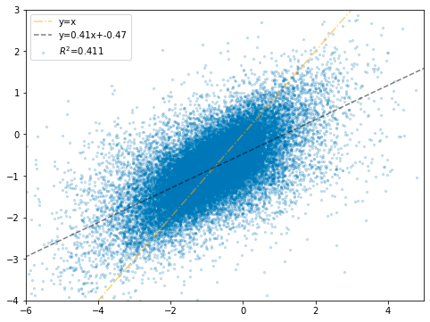

# inappropriate spliting

Added By: Wergilius Z
Created: Feb 17, 2021 11:46 AM

# Inappropriate spliting

## starting:

- we found `test_run/big_capacity_slr.ini` perform very good but can't repeat at all.
- And we later found out that the training process of it, `random_split` is not specify with `torch.Generator().manual_seed(seed)`
- so that we

for model : RL_regressor

run : =`log/Backbone/RL_regressor_ribo/test_run/big_capacity_slr.ini`

### training set

### validation set

## It looks like very good generalization

## we would like to split in a per-mutated seed

test run = `log/Backbone/RL_regressor_ribo/test_run/bc_test.ini` which train on seed=42

### Seed=42

### train set

### val set

### Seed=51 : which will re-mix the train and val set

this will re-mix the train and val set

thus the performance will be a average of two 

### train set

### val set

### therefore , it's highly possible the high performance of  `big_capacity_slr` is caused by inconsistent spliting seed